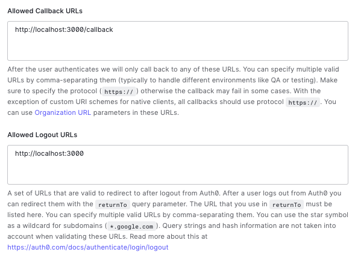
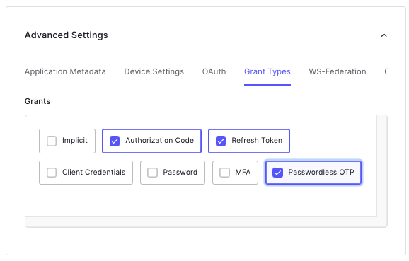
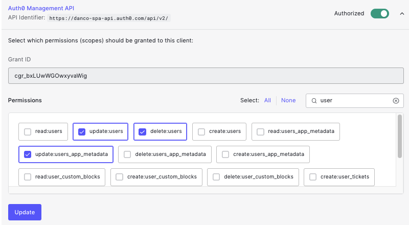

# Update Email w/ Passwordless Validation

## Prerequisites
- NodeJS

## Configuration  

### Auth0  
#### Connections  
1. Create or use an existing username/password database  
2. Enable the "Email Passwordless" connection under Authentication > Passwordless > Email  

#### Applications
1. Create a Regular web application  
  - Set the callback URL to http://localhost:3000/callback  
  - Set the logout URL to http://localhost:3000    
  


2. Scroll down to the bottom of the screen and expand advanced settings > Grant Types and enable "Passwordless OTP"  



3. Enable both the username/password and email passwordless connections  

4. Create an M2M application with access to the Management API  

5. Provide the following scopes  
  * `update:users`
  * `update:users_app_metadata`
  * `delete:users`  


  

### .env 
```
BASE_ULR='application base URL'
ISSUER_BASE_URL='Auth0 tenant domain (default or custom)'
CLIENT_ID='client id'
CLIENT_SECRET='client secret'
MGMT_CLIENT_ID='management API M2M client id'
MGMT_CLIENT_SECRET='management API M2M client secret'
AUTH0_DOMAIN='default auth0 domain'
SECRET='secret used by the oidc package to generate a session'
PORT='application port'
```

## Execution  
In terminal, navigate into the UpdateEmailPasswordless folder and execute
*  `npm install`
* `npm start`

## Testing  
1. Navigate to localhost:3000  
2. Click on Credentials in the nav bar  
3. Enter a new email and click submit  

